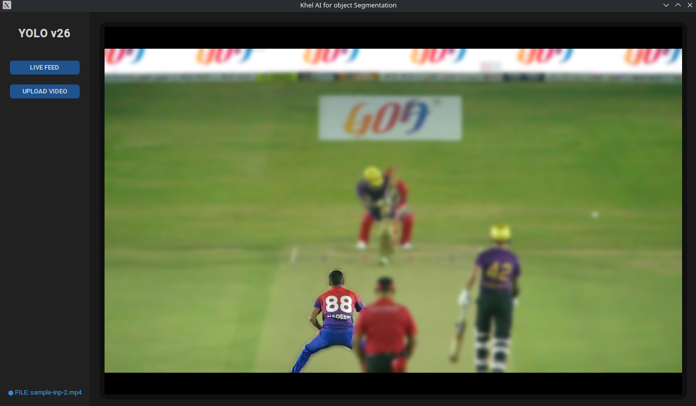

#  **Khel AI Object Segmentation**
## Overview

Khel AI is a desktop application designed for real-time object tracking and segmentation using the YOLOv26 architecture. The project provides a modern graphical user interface built with CustomTkinter that allows users to perform high-precision instance segmentation on both live camera feeds and uploaded video files.

The core functionality focuses on interactive segmentation. Users can select specific objects in the video stream with a mouse click to highlight them. The application then applies a focus effect by maintaining the clarity of the selected object while blurring the surrounding background in real time.


## Dependencies

The project relies on the following primary libraries:

- ***CustomTkinter*** for the modern UI framework.
- ***OpenCV*** for image processing and video handling.
- ***Ultralytics*** for the YOLO segmentation and tracking logic.
- ***PyTorch*** for enabling usage of gpu.
- ***Pillow*** for image compatibility between OpenCV and Tkinter.

## To Run
```bash
    pip install requirements.txt
    python interface.py
```

## Architecture
- model used - Yolo26l-seg and Yolo26n-seg
- yolo segmentation model segments(masks) out the tracking sunbject
- large model for live video and nano model for recorded video
- opencv has builtin onclick classes
- opencv blurs out the remaining part of the tracked object


